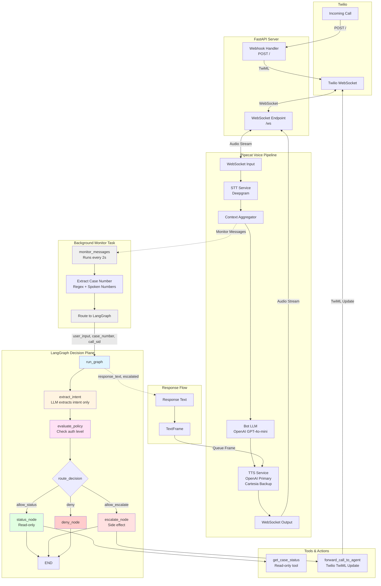

# Policy-aware Voice AI Customer Support PoC

A minimal, real-time voice agent that answers a basic support inquiry (case status) and conditionally allows escalation based on explicit decision rules. The goal is to demonstrate how voice interaction, AI reasoning, and policy-based decisioning can be cleanly separated in a minimal, easy-to-understand setup.

This PoC showcases policy-aware Voice AI for customer support in fintech, healthtech, and education, where real-time conversations must remain safe, auditable, and governed as complexity grows.

## Overview

This system demonstrates **default-deny execution** for Voice AI by:

- Answering simple customer support inquiries ("Why is my case still open?")
- Applying explicit decision rules using LangGraph
- Conditionally escalating live calls to human agents
- Maintaining strict separation between LLM interpretation, policy decision-making, and voice delivery

## Key Features

- **Real-time voice interaction** via Twilio and Pipecat
- **Policy-driven decision making** using LangGraph with default-deny execution
- **Live call escalation** to human agents when policies allow
- **Intent extraction** without execution authority (LLMs interpret only)
- **Minimal architecture** designed for clarity and auditability

## Architecture



### Architecture Flow

1. **Call Initiation**: Twilio receives call → FastAPI webhook returns TwiML → WebSocket connection established
2. **Voice Pipeline**: Audio flows through Pipecat: STT → Context → Bot LLM → TTS
3. **Background Monitoring**: Monitor task watches conversation, extracts case numbers, routes to LangGraph
4. **Policy Decision**: LangGraph extracts intent → evaluates policy → routes to appropriate action node
5. **Execution**: Tools execute (read-only status lookup or call escalation)
6. **Response**: LangGraph response injected as TextFrame → TTS → spoken to user

### Architectural Principle

**LLMs interpret.  
Graphs decide.  
Voice delivers.**

The system enforces strict boundaries:
- LLMs extract intent only (no execution authority)
- LangGraph evaluates policies and routes execution
- Voice pipeline delivers responses
- Tools are only accessible through explicit LangGraph routing

### LLM Roles

Two distinct LLM instances:

1. **Bot LLM** (`bot.py`): Handles conversation flow and natural language responses. No execution authority.
2. **LangGraph LLM** (`graph.py`): Extracts intent only (returns structured JSON). No decisions or actions.

Policy decisions and tool execution are handled exclusively by LangGraph's state machine.

## Prerequisites

- Python 3.10 or higher
- Twilio account with Voice API access
- OpenAI API key
- Deepgram API key
- Cartesia API key (optional, for alternative TTS)
- ngrok or similar tunneling service (for local development with Twilio webhooks)

## Installation

### Using pip

```bash
# Clone the repository
git clone <repository-url>
cd policy-aware-voice-ai-customer-support

# Install dependencies
pip install -e .
```

### Using Docker

```bash
# Build the image
docker build -t policy-aware-voice-ai .

# Run the container
docker run -p 8000:8000 --env-file .env policy-aware-voice-ai
```

## Configuration

1. Copy the example environment file:
   ```bash
   cp env.example .env
   ```

2. Fill in your API keys and configuration:
   ```env
   # Twilio Configuration
   TWILIO_ACCOUNT_SID=your_account_sid
   TWILIO_AUTH_TOKEN=your_auth_token

   # Pipecat Voice Services
   DEEPGRAM_API_KEY=your_deepgram_key
   OPENAI_API_KEY=your_openai_key
   CARTESIA_API_KEY=your_cartesia_key  # Optional

   # Optional Configuration
   WEBSOCKET_URL=wss://your-domain.com/ws  # Auto-detected if not set
   SUPPORT_PHONE_NUMBER=+1234567890
   COMPANY_NAME=YourCompany
   ```

## Running the Application

### Local Development

1. Start the FastAPI server:
   ```bash
   uvicorn main:app --host 0.0.0.0 --port 8000
   ```

2. Expose your local server to Twilio (required for webhooks):
   ```bash
   ngrok http 8000
   ```

3. Configure your Twilio phone number webhook URL:
   - Set the webhook URL to: `https://your-ngrok-url.ngrok.io/`
   - Ensure the URL is accessible via HTTPS/WSS

4. Make a test call to your Twilio phone number

### Production Deployment

The application is stateless and container-friendly. Deploy using:

- Docker containers
- Cloud platforms (AWS ECS, Google Cloud Run, etc.)
- Serverless platforms (with WebSocket support)

Ensure:
- HTTPS/WSS endpoints are configured
- Environment variables are securely managed
- WebSocket connections are properly proxied

## Technology Stack

- **FastAPI** - Web framework and WebSocket server
- **Pipecat** (v0.0.63) - Real-time audio processing pipeline ([API Reference](https://reference-server.pipecat.ai/en/latest/))
- **Twilio** - Call webhooks, audio streaming, and live call forwarding
- **Deepgram** - Speech-to-Text (STT)
- **OpenAI** - Bot LLM (conversation) and LangGraph LLM (intent extraction)
- **Cartesia** - Alternative Text-to-Speech provider
- **LangGraph** - Explicit decision & execution plane for policy enforcement
- **LangSmith** (optional) - Tracing and debugging

## Project Structure

- `main.py` - FastAPI server with webhook and WebSocket endpoints
- `bot.py` - Pipecat voice pipeline and conversation management
- `graph.py` - LangGraph state machine for policy enforcement
- `policies.py` - Decision rules and policy definitions
- `tools.py` - Backend actions (including call escalation)
- `prompts.py` - LLM system prompts for intent extraction
- `docs/` - Comprehensive documentation

## Documentation

For detailed documentation, see the [`docs/`](./docs/) directory:

- **[Architecture Overview](./docs/architecture.md)** - System architecture and components
- **[API Reference](./docs/api-reference.md)** - Complete API endpoint documentation
- **[High-Level Flow](./docs/high-level-flow.md)** - Detailed workflow and process flows

## How It Works

1. **Incoming Call**: Customer calls the Twilio phone number
2. **Webhook**: Twilio sends a POST request to `/`, server responds with TwiML pointing to `/ws`
3. **WebSocket Connection**: Twilio establishes WebSocket connection for bidirectional audio
4. **Case Collection**: Agent asks for case number (required for any actions)
5. **Intent Extraction**: User asks "Why is my case still open?" → LangGraph LLM extracts intent only (structured JSON)
6. **Policy Evaluation**: LangGraph evaluates policy rules (default-deny)
7. **Execution**: Routes to appropriate outcome:
   - Read-only case status (spoken)
   - Escalation denied (spoken explanation)
   - Escalation allowed → call forwarded to human agent

## Limitations (Intentional for PoC)

- In-memory storage only (no database)
- One case per session
- One inquiry per session
- No persistence (data lost on restart)
- No background jobs or retries
- Simulated authentication levels

## Security Considerations

- Use HTTPS/WSS in production
- Store secrets in environment variables
- Implement proper authentication for production use
- Review and secure Twilio webhook endpoints

## License

See [LICENSE](./LICENSE) for details.
